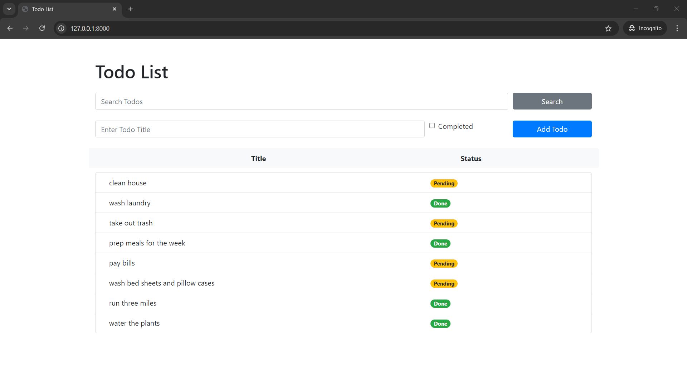
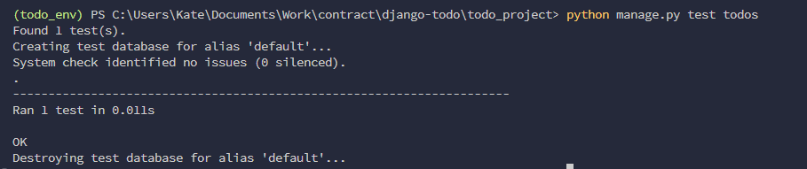

# Basic To do app

## Setup

Note: These steps are only applicable in Windows powershell. If you are using a different OS, please use the alternative commands.

The first thing to do is to clone the repository.

```sh
$ git clone https://github.com/redKath/django-todo.git
$ cd django_todo

```

Create a virtual environment to install dependencies in and activate it:

```sh
$ python -m venv todo_env
$ .\todo_env\Scripts\activate
```

Then install the dependencies:

```sh
(todo_env)$ pip install -r requirements.txt
```
Note the `(todo_cdenv)` in front of the prompt. This indicates that this terminal
session operates in a virtual environment set up by `venv`.

Once `pip` has finished downloading the dependencies:
```sh
(todo_env)$ cd todo_project
(todo_env)$ python manage.py runserver
```
## Run

And navigate to `http://127.0.0.1:8000/`.

If everything was setup correctly, you should see something like this: But of course, you don't have the data yet.



## Tests

To run the tests, `cd` into the `/todo_project` directory where `manage.py` is:
```sh
(todo_env)$ python manage.py test todos
```

If it was successful, you should see something like this.
